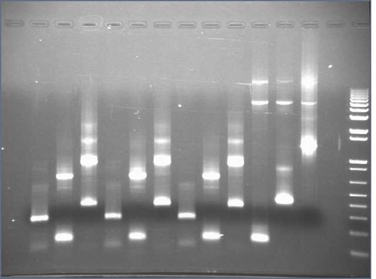

```{r setup, include=FALSE}
knitr::opts_chunk$set(echo = TRUE)
```

```{r LoadingLibraries, include=FALSE}
library(rmarkdown)
library(knitr)
library(reticulate)

# include=FALSE means that the code will not be printed in your PDF. 
```
# R Markdown Demo

This is an R Markdown document. Markdown is a simple formatting syntax for authoring HTML, PDF, and MS Word documents. For more details on using R Markdown see: <http://rmarkdown.rstudio.com>.  

When you click the **Knit** button a document will be generated that includes both content as well as the output of any embedded R code chunks within the document. 

## You can embed an R code chunk like this:
```{r cars}
summary(cars)
```

## We can include plots
```{r pressure, echo=FALSE}
plot(pressure)
```
Note that the `echo = FALSE` parameter was added to the code chunk to prevent printing of the R code that generated the plot.

# We can make different header levels.
## Some headers have different line spacing.

# Header 1
## Header 2
### Header 3
#### Header 4
##### Header 5
###### Header 6

## We can add links:
[This is a link. Try clicking it!](www.rstudio.com)

## Show that code can be embeded in text
```{r TeamCode}
teams = 12
players_per_team = 11
total_players = teams * players_per_team
```
The round has `r total_players` players in total.

## We can also make tables very quickly
```{r PracticeTable}
A = c("1", "2", "3", "4")
B = c(5,10,15,20)
Bacteria = c("Prevotella", "Bacteroides", "Pseudomonas", "Borrelia") 
dataframe = data.frame(A, B, Bacteria)
knitr::kable(dataframe)
```

## We can create nice math Typography
We can write nice math like $A = \pi \times r^{2}$


## We can put Python code into Rmarkdown. 
```{python PythonCode}
a = 324
b = 24
c = a-b
print 'a-b is', c
```

## Insert photos that are in the PWD


## For extra options see this cheat sheet: 
<https://www.rstudio.com/wp-content/uploads/2015/02/rmarkdown-cheatsheet.pdf>
